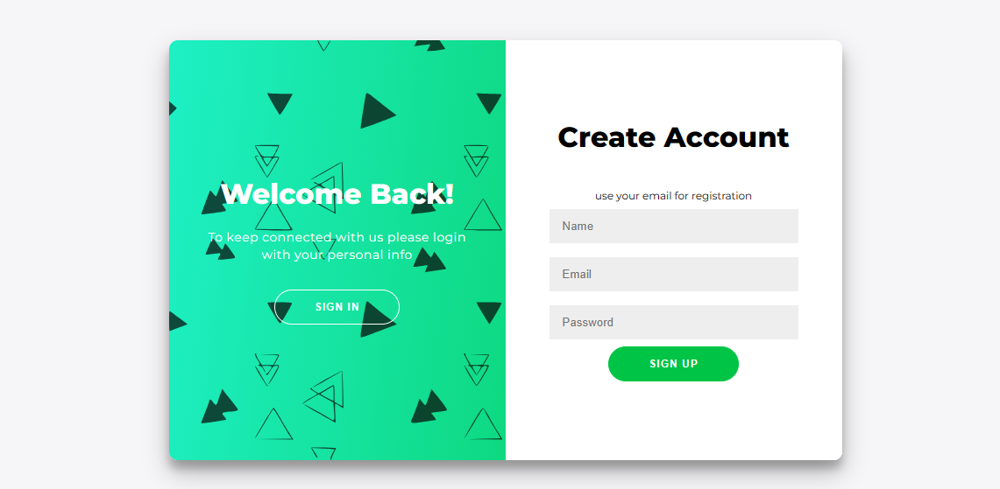

<h1 align="center">authentication in mern</h1> 

<p align="center">
<a href="#key-features">Key Features</a> •
<a href="#how-to-use">How To Use</a> •
<a href="#credits">Credits</a>
</p>

## Key features
* Email verification
* Password reset
* Google authentication

## How to use

To clone and run this application, you'll need [Git](https://github.com/) and [Node.js](https://nodejs.com/) (which comes with npm) installed on your computer. From your command line:
```bash
# Clone this repository
$ git clone <https://github.com/rahmamhb/authentication-in-mern.git>

# Go into the server repository
$ cd server

# Install dependencies
$ npm install

# Run the server
$ nodemon index

# Go into the client repository
$ cd ../client

# Install dependencies
$ npm install

# Run the react app
$ npm start

```

>If you're using Linux Bash for Windows, [see this guide](https://www.howtogeek.com/261575/how-to-run-graphical-linux-desktop-applications-from-windows-10s-bash-shell/) or use node from    the command prompt.


## Credits
This web page uses the following open source packages:
* [Node.js](https://nodejs.com/)
* [Passport.js](https://passportjs.com/)
* [NodeMailer](https://nodemailer.com/)
* [MaterialUI](https://mui.com/)

---
> Github [@rahmamhb]() . Linkedin [rahma mihoub](https://www.linkedin.com/in/rahma-mihoub-b2370b217/) . Behnace [@rahmamhb](https://www.behance.net/rahmamhb)
